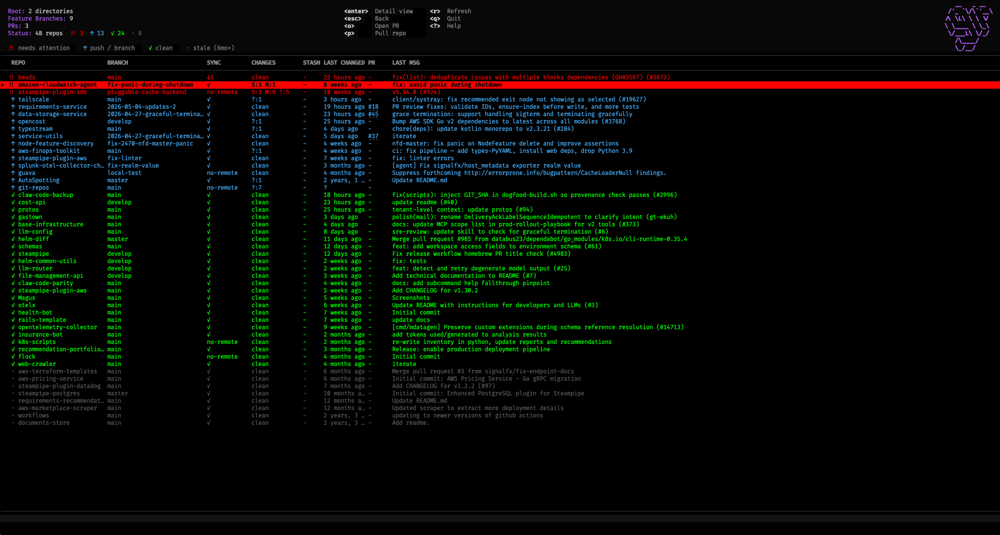

# git-repos

I have a lot of git repos. At any given moment some of them have uncommitted work, some are behind remote, some have an open PR I forgot about. Switching between them to check is tedious, and `git status` only tells you about the one you're in.

`git-repos` scans a directory of repos and shows you everything at once: what branch you're on, whether you're ahead or behind remote, staged/modified/untracked files, stash count, last commit, and any open GitHub PRs, all in a single table.

Because the binary is named `git-repos`, Git treats it as a subcommand automatically, so you can just type `git repos`.

Interactive TUI by default, plain text or JSON when you need to pipe it.

```text
ST  REPO              BRANCH            SYNC    CHANGES       LAST CHANGED  PR   LAST COMMIT
─────────────────────────────────────────────────────────────────────────────────────────────
!!  my-api            feature/auth      ↑2↓1    S:1 M:3       2h ago        #42  fix token refresh
 ↑  frontend          feature/dash      ↑3      ?:2           yesterday     #38  add skeleton
 ✓  infra             main              ✓       clean         3d ago        -    bump terraform
 ·  old-service       main              ✓       clean         8mo ago       -    initial commit
```

Status icons:

- `!!` — needs attention: dirty working tree or behind upstream
- `↑` — needs a push, or you're on a non-main branch
- `✓` — clean and in sync on main/master
- `·` — stale, no commits in 6+ months

## Screenshot of TUI Mode



### Acknowledgements

The TUI aesthetic was shamelessly inspired by [k9s](https://k9scli.io/), the wonderful Kubernetes terminal UI. If you haven't used it, you're missing out.

## Install

### Homebrew (recommended)

```bash
brew install samsar/tap/git-repos
```

### Go

```bash
go install github.com/samsar/git-repos@latest
```

Make sure `$(go env GOPATH)/bin` is on your `$PATH`.

### Build from source

```bash
git clone https://github.com/samsar/git-repos
cd git-repos
go build -o git-repos .
mv git-repos /usr/local/bin/
```

## Usage

```bash
git repos                        # scan configured directory
git repos ~/projects             # scan a specific directory
git repos --fetch ~/projects     # git fetch in every repo first (slower but accurate)
git repos --no-prs               # skip GitHub PR lookup
git repos --plain                # plain text, no TUI
git repos --json                 # JSON output
```

The first time you run it without arguments, it'll ask which directory to scan and save that to `~/.config/git-repos/config.json`. You can also manage this manually:

```bash
git repos config add ~/projects
git repos config add ~/work
git repos config show
git repos config reset
```

## Requirements

- Go 1.21+ (only if building from source)
- `git` on your PATH
- [`gh`](https://cli.github.com/) on your PATH and authenticated — only needed for PR lookup, everything else works without it

## TUI keys

### Navigation

| Key                   | Action                |
| --------------------- | --------------------- |
| `j` / `k` or arrows   | Move up/down          |
| `g` / `G` or Home/End | Jump to top/bottom    |
| `Ctrl+f` / `Ctrl+b`   | Page down/up          |
| `Enter`               | Open repo detail view |
| `Esc`                 | Back to list          |

### Actions

| Key | Action                             |
| --- | ---------------------------------- |
| `p` | Pull (git fetch) the selected repo |
| `o` | Open the repo's PR in your browser |
| `r` | Refresh all repos (runs fetch)     |
| `?` | Toggle help overlay                |
| `q` | Quit                               |

### Sorting (press again to reverse)

| Key | Sort by      |
| --- | ------------ |
| `0` | Status       |
| `N` | Name         |
| `B` | Branch       |
| `S` | Sync         |
| `C` | Changes      |
| `T` | Last changed |
| `P` | PR           |

## Flags

| Flag         | Description                                                                |
| ------------ | -------------------------------------------------------------------------- |
| `--fetch`    | Run `git fetch --prune` before scanning (slower, catches upstream changes) |
| `--no-prs`   | Skip GitHub PR lookup                                                      |
| `--no-color` | Disable color output                                                       |
| `--plain`    | Plain text instead of TUI                                                  |
| `--json`     | JSON output                                                                |
